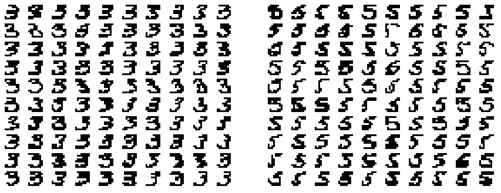
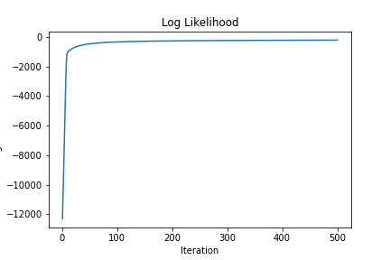
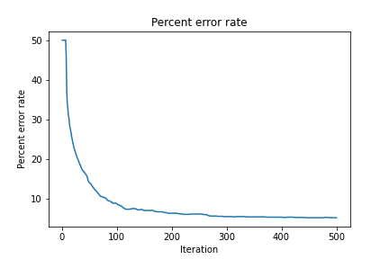

# Handwritten-Digit-Classification

This project uses logistic regression to classify images of handwritten digits. The files ${\tt train3.txt}$, ${\tt test3.txt}$, ${\tt train5.txt}$, and ${\tt test5.txt}$. These files contain data for binary images of handwritten digits. Each image is an 8x8 bitmap represented in the files by one line of text. Some of the examples are shown in the following figure.

  

## Training

This part performs a logistic regression on the images in files ${\tt train3.txt}$ and ${\tt train5.txt}$. The following table reports the log-likelihoods on several iterations of the algorithm, as well as the percent error rate on the images in these files.

  
| Iteration | Log-Likelihood | Percent error rate |
| --- | --- | --- |
| 1 | -12432.8996 | 50 |
| 100 | -330.3417 | 9.286 |
| 200 | -259.4343 | 6.857 |
| 300 | -232.0736 | 5.786 |
| 400 | -217.3136 | 5.714 |
| 500 | -207.9416 | 5.286 |

Following are the plots of log-likelihood and percent error rate vs iterations

  

